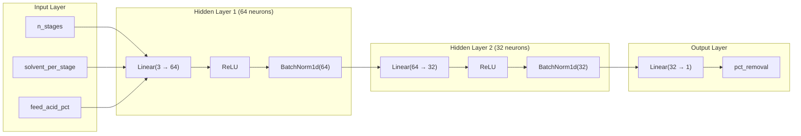
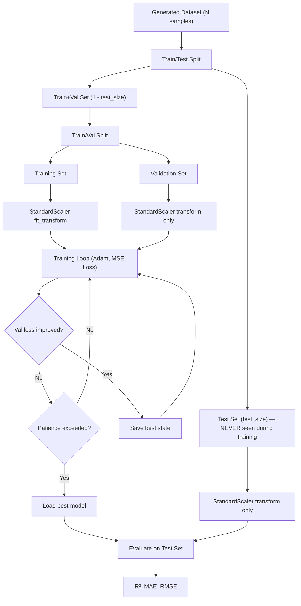

# Mass Transfer 2 Project: Multistage Extraction Digital Twin

## Overview

A Python-based digital twin for simulating and optimizing multistage liquid-liquid extraction processes. The software numerically solves crosscurrent and countercurrent extraction (including reflux) for arbitrary ternary systems using `scipy.optimize.fsolve`. It generates synthetic datasets, trains a PyTorch neural network surrogate model, and provides rich visualizations — all wrapped in a professional PyQt6 desktop GUI.

**Default System:** Cottonseed oil (A) / Oleic acid (C) / Liquid Propane (B) at 98.5 °C, 625 lb/in² abs.
The software is generalized to accept any user-supplied ternary equilibrium tie-line data.

---

<details>
<summary><strong>📄 Project Description (Problem Statement)</strong></summary>

## Problem Statement

Experimental data collection remains expensive and time-consuming. It is therefore important to create a **digital twin** of process systems found in industries. These digital twins can recreate synthetic data that can be useful for building **surrogate models** using neural networks and other methods.

> **Objective:** Create software (preferably with a graphical user interface) using **Python and Python frameworks** to solve the liquid–liquid extraction / solid–liquid extraction problem through the solution of a system of equations, such that a **large number of stages** can be handled. Generalise the problem-solving approach as much as possible.

---

## Software Requirements

The software must contain the following components, all necessary for parameter optimisation:

### 1. Simulation Framework

A simulation framework for solving **multistage crosscurrent and countercurrent extraction** (either liquid–liquid or solid–liquid systems) and comparison of the two processes.

- Use numerical solvers (e.g., `fsolve` in Python/MATLAB) to solve systems of **non-linear algebraic equations**.
- Provide a **generalised framework** capable of handling a large number of stages.
- For initial testing, use guess values close to graphical solutions to validate results.
- Plot equilibrium data and fit a polynomial through the **LL equilibrium curve** using the right-angle triangle method.

> ⚠️ **No marks will be awarded if graphical methods are used as the primary solution approach.**

A **Graphical User Interface (GUI)** is recommended so that users can:

- Enter various equilibrium datasets.
- Choose between crosscurrent or countercurrent operation.

---

### 2. Heat Map Visualisation

Generate heatmaps displaying:

| Quantity                            | Detail    |
| ----------------------------------- | --------- |
| Raffinate / Extract composition     | Per stage |
| Overflow / Underflow composition    | Per stage |
| Flow rates of raffinate and extract | Per stage |
| **Percentage removal of solute**    | Per stage |

The heatmaps must support **any number of stages**.

---

### 3. Response Surface & Optimisation

Generate input–output data to construct a **surrogate model**:

| Parameter                    | Role    |
| ---------------------------- | ------- |
| Number of stages             | Input 1 |
| Solvent amount               | Input 2 |
| Initial feed composition     | Input 3 |
| Percentage removal of solute | Output  |

Use the generated data to create a **response surface** for process optimisation.

---

### 4. Neural Network Model

Fit a neural network model (ANN or RNN) to predict **percentage removal** or **sequential percentage removal** in multi-stage operations:

- Choose the appropriate number of **nodes and layers**.
- Create a **3D surface plot** of percentage removal as a function of any two inputs.
- Create a **contour plot** for the same.
- These plots are necessary for **optimisation of process parameters**.

---

## Group Responsibilities

- Write the **contribution of each member** clearly.
- Each group member must have a **distinct code** to be presented in the PPT.
- All individual codes must be **integrated into a common software**.
- Credit will be given if the algorithm demonstrates **novelty**.

---

## Presentation Requirements

| Component                                                                                       | Marks |
| ----------------------------------------------------------------------------------------------- | ----- |
| Flowchart summary of the work                                                                   | 20    |
| Explanation of code, variables, loops, and functions (per member)                               | 100   |
| Heatmap outputs, regression goodness-of-fit, prediction vs actual, surface plot & optimal point | 80    |

---

## Data — Group 9

**System:** Cottonseed oil system  
**Components:**

- **(A)** Liquid Propane
- **(B)** Oleic Acid
- **(C)** Cottonseed Oil

**Conditions:** 98.5 °C, 625 lb/in² abs.

Smoothed equilibrium tie-line data (in weight percent) is provided in [`data.json`](./data.json).

---

### Problems to Solve

#### i) Plot Equilibrium Data

Plot the equilibrium data on the following coordinate systems:

- **(a)** N against X and Y
- **(b)** X against Y

---

#### ii) Crosscurrent Extraction

**Given:** 100 kg of a cottonseed oil–oleic acid solution containing **25% acid**, extracted **twice** in crosscurrent fashion, each time with **1,000 kg of propane**.

**Determine:**

- Compositions (% by weight) and weights of the **mixed extracts** and the **final raffinate**.
- Compositions and weights of **solvent-free products**.
- Perform computations on the coordinate system from part (a).

---

#### iii) Countercurrent Extraction with Reflux

**Given:** 1,000 kg/h of a cottonseed oil–oleic acid solution containing **25% acid**, separated into products containing **2%** and **90% acid** (solvent-free) by countercurrent extraction with propane.

Perform computations on the coordinate systems of parts (a) and (b):

| Sub-part | Task                                                                                                                                                         |
| -------- | ------------------------------------------------------------------------------------------------------------------------------------------------------------ |
| **(a)**  | Minimum number of theoretical stages required                                                                                                                |
| **(b)**  | Minimum external extract-reflux ratio required                                                                                                               |
| **(c)**  | For an extract-reflux ratio of **4.5**: number of theoretical stages, feed stage position, and flow rates (kg/h) of streams E₁, Bₑ, E′, R₀, R_Np, PE′, and S |
| **(d)**  | Maximum purity of oleic acid that could be obtained, as indicated by the equilibrium data                                                                    |

</details>

---

<details>
<summary><strong>📁 Project Structure</strong></summary>

```
Mass-Transfer2-Project/
├── data.json                  # Default equilibrium tie-line data (cottonseed oil system)
├── requirements.txt           # Pinned Python dependencies
├── CLAUDE.md                  # AI assistant instructions & implementation rules
├── README.md                  # This file — full implementation plan
│
├── src/                       # All source code
│   ├── __init__.py
│   │
│   ├── core/                  # Core solver engine
│   │   ├── __init__.py
│   │   ├── equilibrium.py     # Equilibrium data fitting & interpolation
│   │   ├── crosscurrent.py    # Crosscurrent extraction solver
│   │   └── countercurrent.py  # Countercurrent extraction solver (with reflux)
│   │
│   ├── viz/                   # Visualization module
│   │   ├── __init__.py
│   │   ├── ternary_plots.py   # Right-angle triangle & distribution diagrams
│   │   ├── heatmaps.py        # Stage-wise composition & flow rate heatmaps
│   │   ├── surfaces.py        # 3D response surfaces & contour plots
│   │   └── animations.py      # Animated GIF visualizations (stage stepping, sweeps)
│   │
│   ├── ml/                    # Machine learning / surrogate model
│   │   ├── __init__.py
│   │   ├── data_generator.py  # Synthetic dataset generation via solver sweeps
│   │   ├── neural_net.py      # PyTorch ANN model definition, training, evaluation
│   │   └── optimization.py    # Response surface generation & process optimization
│   │
│   └── gui/                   # PyQt6 GUI
│       ├── __init__.py
│       ├── main_window.py     # Main application window & tab container
│       ├── data_input_tab.py  # Equilibrium data input / loading
│       ├── simulation_tab.py  # Crosscurrent & countercurrent simulation controls
│       ├── heatmap_tab.py     # Heatmap display
│       ├── surrogate_tab.py   # NN training, prediction, response surface & comparison
│       ├── comparison_tab.py  # Side-by-side mode comparison (cross vs counter)
│       └── animation_tab.py   # Animated GIF generation, preview & export
│
├── tests/                     # Unit tests (53 tests)
│   ├── test_equilibrium.py
│   ├── test_crosscurrent.py
│   ├── test_countercurrent.py
│   └── test_neural_net.py
│
└── venv/                      # Python virtual environment (not committed)
```

</details>

---

<details>
<summary><strong>🔧 Implementation Details</strong></summary>

### Phase 0: Data Understanding & Equilibrium Modeling

**Goal:** Load, validate, and model the ternary equilibrium data so it can be used by all solvers.

**File:** `src/core/equilibrium.py`

#### 0.1 Data Format & Conventions

- **Components:** A = Cottonseed Oil (carrier), B = Propane (solvent), C = Oleic Acid (solute)
- **data.json structure:** `phase_1` = raffinate-layer tie-line endpoints, `phase_2` = extract-layer tie-line endpoints. Each row index `i` in phase_1 connects to the same index `i` in phase_2 (they form a tie-line pair).
- **Coordinate system:** Right-angle triangle where x-axis = wt% of A, y-axis = wt% of C, and B = 100 - A - C by closure.

#### 0.2 Solvent-Free Basis Transformation

For numerical solving, convert to solvent-free coordinates:

- **X** = C / (A + C) → solute mass fraction in raffinate (solvent-free)
- **Y** = C / (A + C) → solute mass fraction in extract (solvent-free)
- **N** = B / (A + C) → solvent ratio

#### 0.3 Polynomial Fitting

Fit the following relationships using `numpy.polyfit` (or `scipy.optimize.curve_fit` for non-polynomial models):

1. **Raffinate curve** on the right-angle triangle: C_raff = f(A_raff)
2. **Extract curve** on the right-angle triangle: C_ext = g(A_ext)
3. **Distribution curve:** Y = h(X) — the equilibrium relationship on solvent-free basis
4. **N_raff vs X** and **N_ext vs Y** — solvent ratio curves
5. **Conjugate line** (tie-line correlation): relates a point on the raffinate curve to its conjugate on the extract curve. Fit as X_ext = k(X_raff) or via the conjugate-line slope.

All fits should be stored as callable interpolation functions. Report R² goodness-of-fit.

#### 0.4 Equilibrium Plots (Problem Part i)

Generate the following plots:

- **(a)** N vs X and N vs Y on the same axes
- **(b)** X vs Y (distribution diagram)
- Right-angle triangle diagram with both curves and tie-lines

---

### Phase 1: Crosscurrent Extraction Solver

**Goal:** Solve multistage crosscurrent extraction for any number of stages using `fsolve`.

**File:** `src/core/crosscurrent.py`

#### 1.1 Mathematical Formulation

For a crosscurrent cascade with `N_stages` stages:

- **Given:** Feed composition (wt% A, C), feed flow rate F (kg), solvent flow rate S per stage (kg of pure B), number of stages.
- **Each stage `i`:** Fresh solvent S is mixed with raffinate from stage (i-1).

At each stage, the unknowns are the raffinate and extract compositions + flow rates. The equations are:

1. **Overall mass balance:** R\_{i-1} + S = R_i + E_i
2. **Component A balance:** R\_{i-1} · x_A^{i-1} + S · x_A^S = R_i · x_A^i + E_i · x_A^{E,i}
3. **Component C balance:** R\_{i-1} · x_C^{i-1} + S · x_C^S = R_i · x_C^i + E_i · x_C^{E,i}
4. **Equilibrium:** The raffinate composition (x_A^i, x_C^i) lies on the raffinate curve, and the extract composition (x_A^{E,i}, x_C^{E,i}) lies on the extract curve, connected by a tie-line.
5. **Closure:** x_A + x_C + x_B = 1 for each phase.

This gives a system of nonlinear equations for all stages simultaneously, solved with `fsolve`.

#### 1.2 Solver Implementation

- Function `solve_crosscurrent(feed_comp, feed_flow, solvent_flow_per_stage, n_stages, eq_model)` → returns per-stage compositions, flow rates, and % removal.
- Use the equilibrium model from Phase 0 to enforce tie-line constraints.
- Initial guesses: linear interpolation between feed and pure solvent.

#### 1.3 Validation (Problem Part ii)

Solve the specific problem: 100 kg feed with 25% oleic acid, 2 stages, 1000 kg propane per stage. Report:

- Compositions and weights of mixed extracts and final raffinate
- Solvent-free product compositions and weights

---

### Phase 2: Countercurrent Extraction Solver (with Reflux)

**Goal:** Solve countercurrent extraction including extract reflux for arbitrary stages.

**File:** `src/core/countercurrent.py`

#### 2.1 Simple Countercurrent (No Reflux) — Foundation

For N stages in countercurrent arrangement:

- Feed enters at one end, solvent at the other.
- Raffinate flows left-to-right, extract flows right-to-left.
- At each stage: mass balance + equilibrium.

**Equations per stage i (i = 1, ..., N):**

1. R*i + E*{i-1} = R\_{i-1} + E_i (where E_0 = entering solvent, R_0 = feed)
2. Component balances for A and C
3. Equilibrium tie-line relationship at each stage

The system of 4N+ unknowns is solved simultaneously with `fsolve`.

#### 2.2 Countercurrent with Extract Reflux — Full Implementation

This is the Ponchon-Savarit analog for liquid-liquid extraction. Key concepts:

- **Extract product end:** The extract E1 from stage 1 is sent to a separator. Solvent is removed to give extract product PE'. A portion R0 is refluxed back as external extract reflux.
- **Raffinate product end:** Raffinate RNp leaves the last stage.
- **Feed stage:** Feed F enters at an intermediate stage, splitting the cascade into enriching and stripping sections.

**Key parameters to compute:**

- **Minimum stages** (total reflux): Stage-stepping at total reflux using equilibrium curve and operating line coincidence.
- **Minimum reflux ratio:** Found when an operating line passes through a pinch point (intersection of operating line with tie-line through feed or tangent to equilibrium curve).
- **Actual design** for a given reflux ratio (e.g., 4.5): Determine number of theoretical stages and feed stage location.

**Difference point (Δ) method — numerical implementation:**

- Enriching section operating point Δ_E and stripping section operating point Δ_S are computed from mass balances.
- Stage-by-stage calculation: from one end, alternate between equilibrium (tie-line) and operating line (passing through Δ) to step off stages.
- Feed stage is where the operating point switches from Δ_E to Δ_S.

All stepping is done numerically (no graphical construction): equilibrium lookups use the fitted polynomial, operating line intersections use root-finding.

#### 2.3 Solver Functions

```
solve_countercurrent_simple(feed_comp, feed_flow, solvent_flow, n_stages, eq_model)
find_min_stages(feed_comp, raffinate_spec, extract_spec, eq_model)
find_min_reflux_ratio(feed_comp, raffinate_spec, extract_spec, eq_model)
solve_countercurrent_reflux(feed_comp, feed_flow, reflux_ratio, raffinate_spec, extract_spec, eq_model)
```

Each returns: number of stages, feed stage location, all stream compositions, flow rates (E1, BE, E', R0, RNp, PE', S).

#### 2.4 Validation (Problem Part iii)

Solve: 1000 kg/h feed, 25% oleic acid → products at 2% and 90% acid (solvent-free).

- (a) Minimum theoretical stages
- (b) Minimum external extract-reflux ratio
- (c) For reflux ratio = 4.5: stages, feed stage, stream quantities
- (d) Maximum purity of oleic acid from equilibrium data (plait point analysis)

---

### Phase 3: Visualization Module

**Goal:** Generate all required plots with publication-quality aesthetics.

**File:** `src/viz/ternary_plots.py`, `src/viz/heatmaps.py`, `src/viz/surfaces.py`

#### 3.1 Equilibrium Plots (`ternary_plots.py`)

- **Right-angle triangle diagram:** Both phase envelope curves, tie-lines, operating lines, stage construction.
- **N vs X, Y plot:** Solvent ratio curves for both phases.
- **X vs Y distribution diagram:** With 45° line for reference.
- Use Matplotlib for static plots; Plotly for interactive (embedded in GUI).

#### 3.2 Heatmaps (`heatmaps.py`)

For any solved extraction (cross or countercurrent), generate heatmaps using Seaborn/Plotly showing:

- **Composition heatmap:** Rows = components (A, C, B), Columns = stage number. Separate for raffinate and extract.
- **Flow rate heatmap:** R_i and E_i at each stage.
- **Percentage removal heatmap:** Cumulative and per-stage % removal of solute C.
- Color scales should be intuitive (e.g., diverging for composition, sequential for removal).

#### 3.3 Response Surface Plots (`surfaces.py`)

- **3D surface plots** (Plotly): % removal as a function of two inputs (e.g., n_stages vs solvent_amount).
- **Contour plots:** 2D projections of the response surface.
- **Optimal point marking:** Highlight the optimum on the surface.
- Support all pairwise combinations of 3 inputs: (n_stages, solvent_amount, feed_composition).

---

### Phase 4: Surrogate Model — Data Generation & Neural Network

**Goal:** Generate synthetic data via solver sweeps, train a PyTorch ANN, and use it for fast prediction and optimization.

#### 4.1 Synthetic Data Generation (`src/ml/data_generator.py`)

Run the crosscurrent/countercurrent solver over a grid of input parameters:

| Input Parameter    | Range (example) | Description                                       |
| ------------------ | --------------- | ------------------------------------------------- |
| `n_stages`         | 1–20            | Number of extraction stages                       |
| `solvent_amount`   | 100–5000 kg     | Solvent flow per stage (cross) or total (counter) |
| `feed_composition` | 5–45 wt% acid   | Initial oleic acid content in feed                |

**Output:** `% removal of solute` (and optionally per-stage removal sequence).

Store as a Pandas DataFrame / CSV for reproducibility. Target ~5000–10000 data points.

#### 4.2 Neural Network Model (`src/ml/neural_net.py`)

**Architecture:**

- **ANN (feedforward):** Input(3) → Hidden(64, ReLU, BatchNorm) → Hidden(32, ReLU, BatchNorm) → Output(1)
  - Predicts overall % removal from (n_stages, solvent_amount, feed_composition).
- **Optional RNN (LSTM/GRU):** For predicting sequential stage-by-stage removal.
  - Input: process parameters → Output: sequence of % removal at each stage.

#### Neural Network Architecture Diagram



| Layer | Parameters | Operation |
|-------|-----------|----------|
| Input | 3 features | n_stages, solvent_per_stage, feed_acid_pct (StandardScaler normalized) |
| Hidden 1 | 3×64 + 64 = 256 | Linear → ReLU → BatchNorm1d |
| Hidden 2 | 64×32 + 32 = 2080 | Linear → ReLU → BatchNorm1d |
| Output | 32×1 + 1 = 33 | Linear (inverse-scaled to get % removal) |
| **Total** | **2,369** | |

#### Training Pipeline



**Training pipeline:**

1. Load generated dataset, split into train/val/test (user-configurable ratios, default 70/15/15).
2. Normalize inputs and outputs (StandardScaler). Scalers are fit on training data only.
3. Train with Adam optimizer, MSE loss, batch size 64.
4. Early stopping with patience (default 20 epochs) monitoring validation loss.
5. Report R², MAE, RMSE on held-out test set.
6. Store best model checkpoint (lowest validation loss).

**Prediction vs Actual plots:** Scatter plot of predicted vs actual % removal with R² annotation.

#### 4.3 Response Surface & Optimization (`src/ml/optimization.py`)

- Use the trained ANN as a fast predictor to generate dense response surfaces.
- For each pair of inputs (holding the third constant), evaluate the model on a fine grid → plot 3D surface + contour.
- **Optimization:** Use `scipy.optimize.minimize` (or grid search) on the surrogate model to find optimal operating conditions (e.g., minimize solvent for a target removal).

---

### Phase 5: PyQt6 Graphical User Interface

**Goal:** Professional desktop application integrating all modules.

**Files:** `src/gui/`

#### 5.1 Main Window (`main_window.py`)

- Tab-based layout with **6 primary tabs**.
- Menu bar: File (Load/Save data), Help (About).
- Status bar for solver progress.
- Equilibrium model auto-propagated to all tabs on data load.

#### 5.2 Tab 1: Data Input (`data_input_tab.py`)

- Load equilibrium data from JSON file (file browser).
- Display data in an editable table (QTableWidget).
- Allow manual entry of new tie-line data.
- Component naming (A, B, C labels).
- Button: "Fit Equilibrium Model" → fits polynomials, shows R² values, plots equilibrium curves in embedded Matplotlib canvas.

#### 5.3 Tab 2: Simulation (`simulation_tab.py`)

- **Mode selector:** Crosscurrent / Countercurrent (simple) / Countercurrent (with reflux).
- **Input fields:** Feed composition, feed flow rate, solvent flow rate, number of stages, reflux ratio (if applicable), product specifications.
- **Run button:** Executes solver in a background QThread, displays results in table + embedded plots.
- Results auto-propagate to Heatmaps, Animation, and Comparison tabs.

#### 5.4 Tab 3: Heatmaps (`heatmap_tab.py`)

- Automatically populated after a simulation run.
- Toggle between: composition heatmap, flow rate heatmap, % removal heatmap.
- Stage slider for interactive inspection.
- Export as PNG.

#### 5.5 Tab 4: Surrogate Model (`surrogate_tab.py`)

- **Generate Data** button: Runs parameter sweep (with progress bar).
- **Train Model** button: Trains ANN, shows loss curves live.
  - **Configurable split ratios:** Test split (0.05–0.50) and Val split (0.05–0.40) spinners.
  - **"Show Data Split Visuals"** button (4-panel visualization):
    - Pie chart of train/val/test sizes
    - Predicted vs Actual scatter on held-out test set (colour-coded by error)
    - Error histogram with ±MAE lines
    - Feature-space scatter (solvent vs acid) differentiated by split
- **Predict** section: Input parameters → instant prediction.
- **Response Surface** display: Select two variables, adjust the third with a slider, view 3D surface interactively.
- **Optimization:** Button to find optimal operating point.
- **NN vs Solver Comparison:** Validate the trained ANN against the actual numerical solver.
  - Scatter mode: Latin Hypercube test grid (independent of training data) — predicted vs actual with R², MAE, RMSE.
  - Parameter sweep mode: vary one parameter, compare NN and solver outputs on overlaid line chart + error area plot.

#### 5.6 Tab 5: Comparison (`comparison_tab.py`)

- **Side-by-side extraction mode comparison** with identical input parameters.
- Select any two modes: Crosscurrent, Countercurrent (Simple), Countercurrent (Reflux).
- Shared input panel (feed conditions, stages, solvent, reflux-specific fields shown conditionally).
- Two parallel QThread workers solve both modes simultaneously.
- Three inner result tabs:
  - **Stage Diagram:** Side-by-side X-Y distribution plots.
  - **Heatmap:** Toggleable composition / flow rates / % removal / combined views.
  - **Summary Table:** Two-column metric comparison (removal %, compositions, flow rates, per-stage breakdown).

#### 5.7 Tab 6: Animation (`animation_tab.py`)

- **Generate animated GIF visualizations** of extraction processes.
- Four animation types:

| Animation | Description |
|-----------|------------|
| Stage-by-Stage X-Y Stepping | Stages appear one-by-one on the distribution diagram |
| Ternary Diagram Build-up | Raffinate/extract points appear on the right-angle triangle per stage |
| Composition Profile Evolution | Grouped bar chart grows stage-by-stage + cumulative removal line |
| Parameter Sensitivity Sweep | Varies one parameter, solves for each, shows X-Y + ternary + rolling metrics |

- Built-in GIF player with Play/Pause controls at configurable FPS.
- Save GIF export button.
- Uses Matplotlib FuncAnimation + PillowWriter (no ffmpeg required).

---

### Phase 6: Integration, Testing & Validation

#### 6.1 Unit Tests (`tests/`)

- Test equilibrium fitting against known data points.
- Test crosscurrent solver against Problem Part (ii) hand-calculated values.
- Test countercurrent solver against Problem Part (iii) expected results.
- Test NN model convergence on a small dataset.

#### 6.2 Validation Workflow

Run the complete pipeline for the cottonseed oil system:

1. Load `data.json` → fit equilibrium → verify plots match expected curves.
2. Solve Part (ii) crosscurrent → verify compositions and weights.
3. Solve Part (iii) countercurrent with reflux → verify min stages, min reflux, design at R=4.5.
4. Generate surrogate data → train NN → generate response surfaces.
5. Run GUI end-to-end.

</details>

---

## Group Member Assignment (3 Members)

| Member       | Primary Module       | Files                                                                 | Key Deliverables                                                                                                  |
| ------------ | -------------------- | --------------------------------------------------------------------- | ----------------------------------------------------------------------------------------------------------------- |
| **Member 1** | Core Solvers         | `equilibrium.py`, `crosscurrent.py`, `countercurrent.py`              | Equilibrium fitting, crosscurrent solver, countercurrent solver with reflux, validation of Parts (i), (ii), (iii) |
| **Member 2** | Visualization & Data | `ternary_plots.py`, `heatmaps.py`, `surfaces.py`, `data_generator.py` | All equilibrium plots, heatmaps, response surfaces, synthetic data generation                                     |
| **Member 3** | ML & GUI             | `neural_net.py`, `optimization.py`, `gui/*`                           | ANN training pipeline, surrogate prediction, PyQt6 GUI, system integration                                        |

All members collaborate on `gui/` integration.

---

## Tech Stack

| Component              | Technology                     |
| ---------------------- | ------------------------------ |
| Language               | Python 3.9+                    |
| Numerical Solver       | `scipy.optimize.fsolve`        |
| Data Handling          | NumPy, Pandas                  |
| Plotting (static)      | Matplotlib, Seaborn            |
| Plotting (interactive) | Plotly                         |
| Neural Network         | PyTorch                        |
| GUI Framework          | PyQt6                          |
| Curve Fitting          | NumPy polyfit, SciPy curve_fit |

---

## Setup Instructions

```bash
# Clone the repository
git clone https://github.com/17kaushalsingh/Mass-Transfer2-Project.git
cd Mass-Transfer2-Project

# Create and activate virtual environment
python3 -m venv venv
source venv/bin/activate

# Install dependencies
pip install -r requirements.txt

# Run the GUI application
python -m src.gui

# Run all tests (53 tests)
python -m pytest tests/ -v
```

---

## Current Status

All 6 phases are implemented and tested:

| Phase     | Module                | Status           | Tests             |
| --------- | --------------------- | ---------------- | ----------------- |
| Phase 0   | Equilibrium Model     | Complete         | 18/18 passing     |
| Phase 1   | Crosscurrent Solver   | Complete         | 7/7 passing       |
| Phase 2   | Countercurrent Solver | Complete         | 14/14 passing     |
| Phase 3   | Visualizations        | Complete         | Import verified   |
| Phase 4   | Surrogate Model       | Complete         | 14/14 passing     |
| Phase 5   | PyQt6 GUI             | Complete         | Import verified   |
| **Total** |                       | **All complete** | **53/53 passing** |

---

## Quick Start

1. **Launch the GUI:** `python -m src.gui`
2. The default cottonseed oil equilibrium data loads automatically
3. Go to **Simulation** tab → select mode → click **Run Simulation**
4. View results in **Heatmaps** tab
5. Train a surrogate model in **Surrogate Model** tab → set split ratios → click **Show Data Split Visuals**
6. Validate the NN: use **NN vs Solver Comparison** (Section 5 in Surrogate tab)
7. **Compare modes** side-by-side in the **⚖ Comparison** tab
8. Generate **animated GIF** visualizations in the **🎬 Animation** tab

---

## Implementation Order

```
Phase 0  →  Phase 1  →  Phase 2  →  Phase 3  →  Phase 4  →  Phase 5  →  Phase 6
 Equil.    Cross-curr.  Counter-curr.   Viz        ML/NN       GUI       Testing
 Model      Solver       Solver       Module     Surrogate   PyQt6     Validation
```

Each phase is self-contained and testable before moving to the next. Phases 3 and 4 can be partially parallelized since they depend on Phases 0–2 outputs but not on each other.

---
